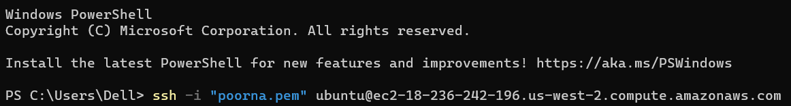

Exercise
--------

Create a Jenkins pipeline which deploys spring petclinic application into some linux machine

Suggestions:
Run springboot as a linux daemon
Use git flow as branching strategy 

Create a jenkins job for merging pull requests into develop branch

Fork the spring petclinic into your account

Have Jenkinsfile in your branches
